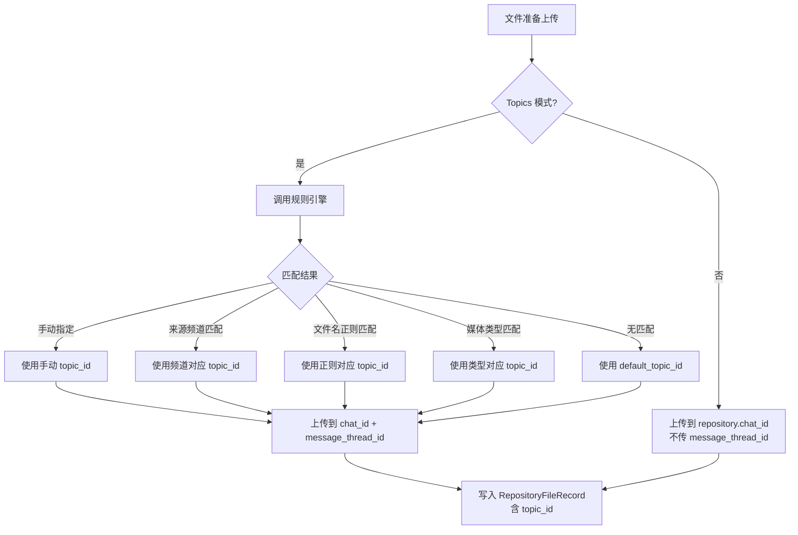
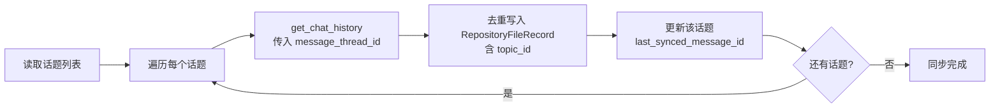

# Topics 话题群分类存储 PRD

> **项目**: TRMD  
> **版本**: v1.0  
> **日期**: 2026-08-11  

---

## 需求背景

TRMD 当前的仓库模式使用**单一频道**（`repository.chat_id`）存储所有下载和转发的媒体文件。所有文件无差别地上传到同一频道，没有分类路由、子频道或目录索引机制。去重逻辑基于 `file_unique_id` 和 SHA256 内容哈希，分发记录通过 `file_distributions` 表追踪文件的目标去向。

随着使用场景扩展，用户需要按类别管理媒体文件——将电视剧、漫画、不同模特的图片分别存储到不同分类中，便于检索和管理。当前单一频道模型无法满足这一需求。

> **技术契机**：Telegram 超级群的 Topics（话题）功能提供群内的原生文件夹结构，每个话题相当于一个独立的消息区域。将仓库从单一频道改为开启 Topics 的超级群，上传时通过 Pyrogram 的 `message_thread_id` 参数即可将文件路由到对应话题。TRMD 依赖的 kurigram 2.2.19 已支持该参数，但当前所有上传/复制/分发调用均未传递。

### 当前架构局限

| 维度 | 当前状态 | 目标状态 |
|------|----------|----------|
| 仓库目标 | 单一频道（channel） | 超级群 + Topics（supergroup + forum） |
| 文件分类 | 无分类，全部混存 | 按话题分类存储 |
| 上传路由 | 统一 chat_id，无 thread_id | chat_id + message_thread_id 动态路由 |
| 仓库同步 | 遍历整个频道历史 | 按话题分别遍历同步 |
| 仓库浏览 | 平铺文件列表 | 按话题筛选 + 手动重新分类 |
| 去重维度 | file_unique_id + content_hash | file_unique_id + content_hash + topic_id |

---

## 功能需求详情

### 模块一：话题分类配置

用户在 Web UI 配置页面中启用 Topics 模式，将仓库目标从单一频道切换为开启 Topics 的超级群。配置内容包括超级群 chat_id、默认话题 ID，以及分类列表管理。系统提供「发现话题」功能，通过调用 Telegram API 获取超级群中所有可用话题列表，方便用户在配置分类时选择正确的话题 ID。

#### 页面布局

- **顶部区域**：Topics 模式总开关，控制是否启用话题分类功能
- **中部区域**：仓库群组配置（超级群 Chat ID、默认话题 ID、发现话题按钮）
- **下部区域**：分类列表表格（分类名称、话题 ID、匹配规则摘要、操作按钮）

#### 业务逻辑

当 Topics 模式开关关闭时，系统保持原有行为——所有文件上传到 `repository.chat_id` 指定的频道，不传递 `message_thread_id`。当开关开启时，系统要求 `repository.chat_id` 必须指向一个已开启 Topics 的超级群，否则在上传时会收到 Telegram API 错误。系统在保存配置时校验 chat_id 有效性。

用户可以添加、编辑、删除分类条目。每个分类包含：分类名称（显示用）、话题 ID（上传路由用）、匹配规则列表。分类名称在仓库浏览页面作为筛选标签显示。话题 ID 必须为该超级群中实际存在的话题，系统通过「发现话题」功能获取可用列表供用户选择。

默认话题 ID 指向超级群的 General 话题（通常是 topic_id=1），用于存放未匹配任何分类规则的文件。该字段不可为空，确保所有文件都有明确的存储位置。

#### 配置结构

```yaml
repository:
  enabled: true
  chat_id: "-100xxxxxxxxxx"
  auto_sync_enabled: false
  auto_sync_interval_minutes: 60
  topics:
    enabled: true
    default_topic_id: 1
    categories:
      - name: "电视剧"
        topic_id: 123
        match_rules:
          - type: source_channel
            value: "-100aaa"
          - type: filename_regex
            value: "EP\\d+|第\\d+集|S\\d+E\\d+"
      - name: "漫画"
        topic_id: 456
        match_rules:
          - type: source_channel
            value: "-100bbb"
      - name: "模特A"
        topic_id: 789
        match_rules:
          - type: source_channel
            value: "-100ccc"
```

#### 字段规则

| 字段 | 类型 | 必填 | 说明 |
|------|------|------|------|
| topics.enabled | Boolean | 是 | Topics 模式开关，关闭时回退到单一频道行为 |
| topics.default_topic_id | Integer | 是（当 enabled=true） | 默认话题 ID，未匹配规则的文件存入此话题 |
| topics.categories | Array | 否 | 分类列表，可为空（所有文件存入默认话题） |
| categories[].name | String | 是 | 分类显示名称，2-30 字符 |
| categories[].topic_id | Integer | 是 | 目标话题 ID，必须为超级群中实际存在的话题 |
| categories[].match_rules | Array | 是 | 匹配规则列表，至少 1 条 |
| match_rules[].type | Enum | 是 | source_channel / filename_regex / media_type |
| match_rules[].value | String | 是 | 规则值（chat_id / 正则表达式 / 媒体类型名） |

> **边界情况**：当用户从 Topics 模式切换回普通频道模式时，已存储在话题中的文件记录仍然保留 topic_id 字段，但新上传的文件不再传递 thread_id。RepositorySync 在普通模式下遍历整个群组历史（不区分话题），在 Topics 模式下按话题遍历。

**交互原型**：[话题分类配置页面](prototypes/proto1-config.html)

---

### 模块二：分类规则引擎

当文件准备上传到仓库时，分类规则引擎根据预设规则决定该文件应上传到哪个话题。规则按优先级从高到低依次匹配，第一个匹配结果即为最终目标话题。

#### 规则类型与优先级

| 优先级 | 规则类型 | 匹配逻辑 | 典型场景 |
|--------|----------|----------|----------|
| 1（最高） | 手动指定 | 任务创建时用户直接选择目标话题 | 临时归类、批量导入特定分类 |
| 2 | 来源频道映射 | 文件来源频道的 chat_id 等于规则配置的 value | 不同 TG 频道对应不同分类 |
| 3 | 文件名正则 | 文件名匹配规则中的正则表达式 | 按文件名特征分类（EP01、第1集等） |
| 4 | 媒体类型 | 文件 MIME 类型或 Pyrogram 媒体类型匹配 | 所有视频归入电视剧、所有图片归入模特 |
| 5（最低） | 默认话题 | 无任何规则匹配时的兜底 | 未分类文件的收纳 |

引擎在文件上传前执行分类决策。对于相册组（media_group），引擎对组内第一个文件进行分类，同组所有文件使用相同的话题 ID，确保相册的视觉完整性。如果手动指定了话题（优先级 1），则跳过所有自动规则匹配。

**交互原型**：[分类规则引擎匹配流程](prototypes/proto2-rule-engine.html)

---

### 模块三：话题感知上传

所有上传到仓库的方法在调用 Pyrogram API 时传递 `message_thread_id` 参数，将文件路由到正确的话题。上传流程在原有基础上增加分类决策步骤——在调用上传 API 之前，先通过规则引擎确定目标话题 ID，然后将该 ID 传递给上传方法。

#### 上传流程



#### 需修改的调用点

当前代码中所有上传/复制/分发调用均未传递 `message_thread_id`，需要逐一添加：

| 文件 | 方法 | Pyrogram 调用 | 修改内容 |
|------|------|---------------|----------|
| repository/manager.py | distribute_to_target | client.copy_message | 添加 message_thread_id 参数 |
| repository/manager.py | _send_by_file_id | send_photo/video/audio/animation/document | 添加 message_thread_id 参数 |
| task/executor.py | _handle_listen_forward | client.copy_message (仓库复制) | 传递规则引擎返回的 topic_id |
| task/executor.py | _execute_forward | client.copy_message (仓库复制) | 传递规则引擎返回的 topic_id |
| download/file_manager.py | upload | send_photo/video/audio/animation/document | 新增 message_thread_id 参数 |
| download/file_manager.py | upload_media_group | send_media_group | 新增 message_thread_id 参数 |
| download/uploader.py | _send_media / _send_multi_media | raw.functions.messages.SendMedia / SendMultiMedia | 添加 reply_to_top_id 指定话题 |

#### 去重增强

去重检查在原有 `file_unique_id` + `content_hash` 基础上，增加 `topic_id` 维度。同一文件如果已存在于目标话题中，则跳过上传，直接通过 `distribute_to_target` 分发到目标位置。这意味着同一文件可以存在于不同话题中（不同分类可能包含相同文件），但同一话题内不会重复存储。

> **相册组处理**：media_group 的所有文件必须上传到同一话题。规则引擎对组内第一个文件执行分类决策，同组所有文件使用该结果。`upload_media_group` 调用时统一传递相同的 `message_thread_id`。

---

### 模块四：话题感知同步

RepositorySync 的增量同步从「遍历整个频道历史」改为「按话题分别遍历」。系统为每个话题维护独立的 `last_synced_message_id`，同步时分别遍历每个话题的消息历史。

#### 同步流程



RepositoryDB 需要新增话题级别的同步状态追踪。原有同步状态仅记录整个频道的 `last_message_id`，改为按话题记录。同步时对每个话题调用 `get_chat_history` 并传入 `message_thread_id` 参数，获取该话题下的消息列表。

#### 数据模型变更

RepositoryFileRecord 新增 `topic_id` 字段（Integer, nullable），标记文件存储在哪个话题中。历史数据（Topics 模式启用前的文件）该字段为 NULL，浏览时归入「未分类」。

同步状态表新增按话题记录的 `last_synced_message_id`。如果 Topics 模式是在已有数据的基础上启用的，首次同步时需要遍历所有话题（包括 General 话题），将已有文件的记录补上 topic_id。

**交互原型**：[话题同步状态面板](prototypes/proto4-sync-status.html)

---

### 模块五：仓库浏览与管理

仓库浏览页面新增话题筛选功能。用户通过下拉菜单选择话题，筛选显示该话题下的文件列表。每个话题显示文件统计（数量、总大小）。用户可以对单个文件执行「重新分类」操作，将文件从当前话题移动到其他话题。

#### 页面布局

- **筛选栏**：话题下拉选择器 + 媒体类型筛选 + 搜索框
- **统计区**：当前话题的文件总数、总大小、最近更新时间
- **文件列表**：卡片网格，每张卡片显示缩略图、文件名、话题标签、来源频道
- **操作菜单**：每张卡片支持「重新分类」「复制链接」「删除」操作

#### 重新分类逻辑

用户选择文件并指定新话题后，系统执行以下步骤：在目标话题中通过 `copy_message` 复制文件（传递新的 `message_thread_id`），更新 `RepositoryFileRecord` 的 `topic_id` 字段和 `repository_message_id`，然后删除原话题中的消息。如果目标话题中已存在相同 `file_unique_id` 的文件，则跳过复制，仅更新记录指向已有的消息。

#### 新增 API 端点

| 方法 | 路径 | 说明 |
|------|------|------|
| GET | /api/repository/topics | 获取所有已配置的分类及话题信息 |
| GET | /api/repository/topics/{topic_id}/files | 获取指定话题下的文件列表（分页） |
| GET | /api/repository/chat/topics | 从 Telegram 超级群获取可用话题列表 |
| POST | /api/repository/files/{file_unique_id}/reclassify | 将文件重新分类到指定话题 |

已有的 `GET /api/repository/files` 端点新增 `topic_id` 查询参数，支持按话题筛选。不传 `topic_id` 时返回所有文件（含 topic_id 为 NULL 的历史数据）。

**交互原型**：[仓库浏览页面](prototypes/proto5-repository.html)

---

### 模块六：任务创建中的话题指定

在 Web UI 和 Bot 接口创建下载或转发任务时，用户可以选择目标话题。提供两种模式：自动分类（由规则引擎决定）和手动指定（用户直接选择话题）。手动指定的优先级高于规则引擎，跳过所有自动匹配逻辑。

#### 交互逻辑

任务创建表单中新增「目标话题」字段组，包含两个单选选项：「自动分类（推荐）」和「手动指定」。选择「自动分类」时，任务不携带 topic_id，上传时由规则引擎实时决策。选择「手动指定」时，显示话题下拉选择器，列出所有已配置的分类话题，用户选择后该 topic_id 随任务持久化，上传时直接使用。

对于 Bot 接口，新增可选参数 `topic_id`。不传时使用自动分类，传值时使用指定话题。如果传入的 topic_id 不在已配置的分类列表中，返回参数校验错误。

#### 字段规则

| 字段 | 类型 | 必填 | 说明 |
|------|------|------|------|
| topic_mode | Enum | 否（默认 auto） | auto / manual |
| topic_id | Integer | 仅 mode=manual 时必填 | 目标话题 ID，必须为已配置的分类话题 |

任务数据模型中新增 `topic_mode` 和 `topic_id` 两个字段。任务执行时，如果 `topic_mode=manual`，Executor 直接使用 `topic_id` 作为上传参数；如果 `topic_mode=auto`，Executor 在上传前调用规则引擎获取 topic_id。任务详情和日志中记录最终使用的 topic_id，便于追溯。

**交互原型**：[任务创建表单](prototypes/proto6-task-creation.html)
