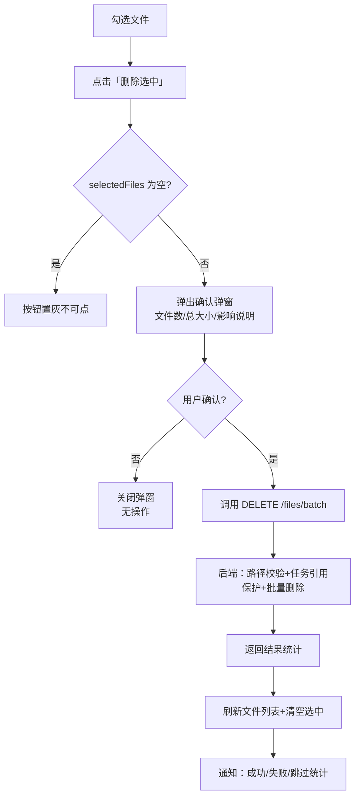
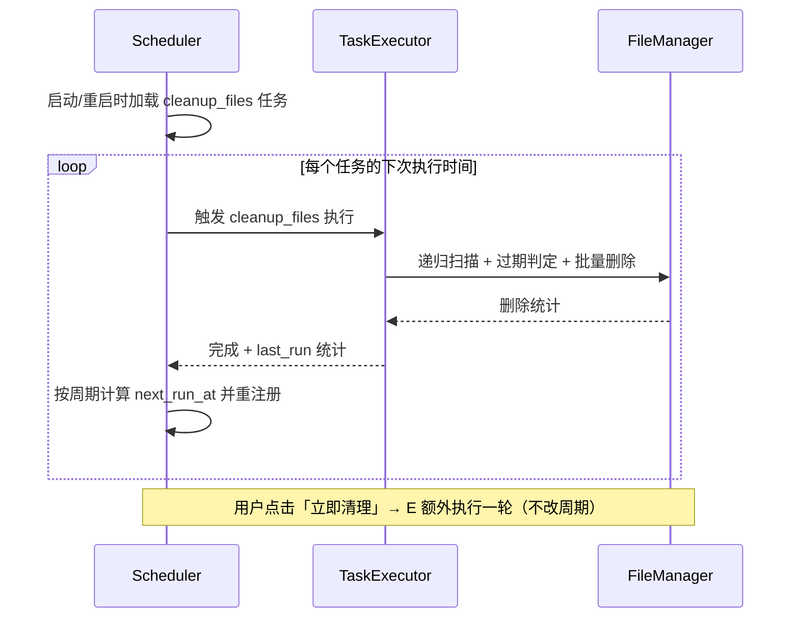

# TRMD 文件管理删除功能 PRD

> **项目名称**: Telegram_Restricted_Media_Downloader (TRMD)  
> **文档版本**: v1.0  
> **创建日期**: 2026-09-07  
> **作者**: SOLO / AI Assistant  
> **状态**: 待评审  
> **关联文档**: [PRD-产品需求文档.md](PRD-产品需求文档.md)、模块设计-文件管理器.md、模块设计-WebAPI.md、模块设计-Web界面.md、模块设计-任务管理器.md

---

## 更新日志

| 版本 | 日期 | 变更内容 | 作者 |
|------|------|----------|------|
| v1.0 | 2026-09-07 | 初版：文件管理页手动批量删除 + 定时清理任务（cleanup_files） | AI Assistant |

---

## 一、需求背景

### 1.1 背景

文件管理页（`files.html`）当前提供文件**浏览、勾选、上传**能力：

- 文件列表支持勾选（`file-checkbox`）与全选
- 上传区分单文件/媒体组，支持「上传后删除本地文件」
- 后端已具备单文件安全删除能力（`FileManager.delete_local_file` → `safe_delete`），但**未向 WebUI 暴露删除入口**

当前存在以下问题：

| 问题 | 描述 |
|------|------|
| **磁盘占用不可控** | 下载的文件长期滞留在 `save_directory`，无任何自动回收机制 |
| **手动清理不便** | 删除过期文件需登录服务器操作，普通用户无法自助处理 |
| **上传流程割裂** | 已有「上传后删除」但不能在不上传时清理选中文件 |
| **无过期策略** | 系统内无任何文件保留期（retention）概念，仅依赖 token/缓存等内部数据自清理 |

### 1.2 目标

| 目标 | 说明 |
|------|------|
| 手动批量删除 | 用户在文件管理页勾选文件，二次确认后实时物理删除 |
| 定时自动清理 | 用户配置「定时清理」任务，按保留天数（如 7 日、1 日）周期清理过期文件 |
| 可观测 | 清理结果以任务形式记录，删除的文件数、释放空间可追溯 |
| 安全兜底 | 路径白名单、任务引用保护、确认机制，杜绝误删 |

### 1.3 范围与边界

**本期范围内**：

- 文件管理页：勾选后的批量删除
- 新增任务类型 `cleanup_files`（定时清理）
- 任务调度能力（周期执行）的最小化扩展

**本期范围内但不影响现有行为**：

- 保留「上传后删除」等既有逻辑不变
- 仓库模式（repository）数据表不受影响——本地删除不影响已上传至 Telegram 的远端文件

**明确不在范围内**：

- Telegram 远端消息删除（本功能只清理本地磁盘文件）
- 回收站/软删除（本期采用「二次确认 + 直接删除」，见 §3.1.2）
- Bot 端文件管理命令改造（本期仅 WebUI，Bot 命令 `upload_download_delete` 等不受影响）

### 1.4 名词解释

| 名词 | 说明 |
|------|------|
| 本地文件 | 位于 `save_directory`（配置 `task.save_directory`，默认 `downloads`）下的文件 |
| 保留天数 | `keep_days`，文件最后修改时间距今超过该天数即视为过期 |
| 定时清理任务 | 任务类型 `cleanup_files` 的任务实例 |
| 过期文件 | 满足清理判定条件（见 §3.2.3）的文件 |

---

## 二、总体方案

```
┌─────────────────────────────────────────────────────────────────────┐
│                     文件管理删除功能总体架构                             │
├─────────────────────────────────────────────────────────────────────┤
│                                                                     │
│   文件管理页 (files.html)                     任务管理页 (tasks.html)    │
│   ├─ 勾选文件 ──► 删除选中按钮 ──► 确认弹窗        ├─ 创建「定时清理」任务     │
│   │                                            └─ 任务列表查看/手动执行    │
│   ▼                                            ▼                       │
│   DELETE /files/batch                    POST /tasks (cleanup_files)  │
│        │                                          │                  │
│        ▼                                          ▼                  │
│   ┌─────────────────┐                 ┌──────────────────────┐       │
│   │ FileManager     │                 │ TaskExecutor         │       │
│   │ delete_local_file│                 │  ├─ 扫描目录+过期判定 │       │
│   │ (safe_delete)   │                 │  ├─ 批量删除          │       │
│   └─────────────────┘                 │  └─ 写任务统计        │       │
│                                       └─────────▲────────────┘       │
│                                                 │                    │
│                                    ┌────────────┴────────────┐       │
│                                    │ Scheduler（新增）          │       │
│                                    │ 按 cron/间隔 re-arm 调度  │       │
│                                    └────────────────────────┘       │
│                                                                     │
│   安全：路径白名单(_check_system_path) · 任务引用保护 · 二次确认       │
└─────────────────────────────────────────────────────────────────────┘
```

两条能力线：

1. **手动批量删除**：纯同步、即时反馈，直接调用文件删除能力
2. **定时清理任务**：复用现有任务系统（任务模型、执行器、API、前端任务页），新增「周期调度」能力与 `cleanup_files` 任务类型

---

## 三、功能需求详情

### 模块一：文件管理页手动批量删除

#### 3.1.1 交互流程

在文件管理页现有勾选能力基础上增加删除入口：

- **入口**：顶部操作栏新增「🗑️ 删除选中」按钮（与现有「上传选中文件」并列），仅当 `selectedFiles.length > 0` 时可用
- **确认弹窗**：点击后弹出二次确认，展示：选中文件数、总大小、删除影响说明（物理删除不可恢复、正在下载/上传中的文件将被跳过）
- **执行**：确认后调用批量删除接口；执行中按钮置灰并展示进度文案；完成后：
  - 刷新当前目录文件列表
  - 清空选中态
  - 通知展示结果（成功 N 个，失败/跳过 M 个）



#### 3.1.2 删除安全机制

| 机制 | 说明 |
|------|------|
| 二次确认 | 弹窗展示数量与大小，确认后执行 |
| 路径白名单 | 复用 `FileManager._check_system_path` 黑名单（Windows 系统目录），对每个路径校验 |
| 目录内安全 | 仅处理**文件**，勾选逻辑已排除目录（`toggleFileSelection` 忽略目录） |
| 任务引用保护 | 跳过被**排队中/执行中任务**引用的文件（见 §3.1.3 判定来源） |
| 中间文件保护 | 跳过 `.temp` 等正在写入的文件（下载中） |
| 不存在的路径 | 视为已删除，计入成功（幂等） |

> **任务引用保护判定来源**：遍历状态为 `pending/queued/running` 的任务：
> - `upload` 任务 → `params.file_paths` / 子任务 `file_path`
> - `download` 任务 → 保存路径（`save_directory` 下推断）或子任务 `file_path`
> - `cleanup_files` 任务不产生文件引用
> 被引用的文件本次跳过，并在结果中标记 `skipped: true, reason: "task_referenced"`。

#### 3.1.3 后端接口

| 方法 | 路径 | 说明 |
|------|------|------|
| DELETE | /api/files/batch | 批量删除文件 |

**DELETE /api/files/batch**

请求体：

```json
{
  "file_paths": ["/data/downloads/a.mp4", "/data/downloads/sub/b.jpg"]
}
```

| 字段 | 类型 | 必填 | 校验规则 |
|------|------|------|----------|
| file_paths | Array\<String\> | 是 | 1~500 条；每条须为绝对路径且位于 `save_directory` 之下；超出则整体拒绝 |

响应：

```json
{
  "code": 0,
  "data": {
    "total": 2,
    "deleted": 1,
    "failed": 0,
    "skipped": 1,
    "results": [
      {
        "file_path": "/data/downloads/a.mp4",
        "success": true,
        "deleted": true,
        "skipped": false,
        "reason": null
      },
      {
        "file_path": "/data/downloads/sub/b.jpg",
        "success": true,
        "deleted": false,
        "skipped": true,
        "reason": "task_referenced"
      }
    ]
  }
}
```

| 响应字段 | 说明 |
|----------|------|
| total | 请求文件总数 |
| deleted | 实际删除数 |
| failed | 删除失败数（权限不足等，附原因） |
| skipped | 因保护规则跳过的数量 |
| results[].reason | `task_referenced` / `in_progress` / 失败原因 |

**安全校验顺序**：数量上限 → 路径绝对化归一化 → 越界检查（必须在 `save_directory` 内）→ 系统目录黑名单 → 任务引用保护 → 逐个删除。

#### 3.1.4 边界与异常

| 场景 | 行为 |
|------|------|
| 选中文件中某个正在被下载（`.temp` 或运行中任务引用） | 跳过该文件，其余正常删除，提示「N 个文件因使用中已跳过」 |
| 删除操作与上传操作并发 | 上传中的文件被跳过，避免删除正在读取的文件 |
| 路径非法（越界/不存在白名单系统目录） | 单条失败并返回原因，不整体回滚 |
| 目录被选中 | 前端勾选逻辑已排除目录；若绕过前端直接传目录路径，后端单条失败 |
| 权限不足 | 单条失败，返回原因，其余继续 |
| 大量文件（>500） | 整体拒绝，提示拆分选择 |
| 服务重启后 | 无需恢复，删除为一次性同步操作 |

---

### 模块二：定时清理任务

#### 3.2.1 功能概述

新增任务类型 **`cleanup_files`（定时清理）**，在「任务管理」页以标准任务形态呈现：

- **可配置**：保留天数、执行周期（每日固定时刻 / 每隔 N 小时）、清理范围（整个下载目录递归）
- **可管理**：与下载/转发/监听任务一致，支持创建、查看详情、手动立即执行、暂停/恢复、删除
- **可观测**：任务详情展示最近一次清理统计（扫描文件数、删除数、释放空间、耗时）与下次计划执行时间

#### 3.2.2 任务参数

**创建表单（任务管理页「新建任务」→「定时清理」）**

- 保留天数：预设快捷选项 `1日 / 3日 / 7日 / 30日` + 自定义（整数，1~365）
- 执行周期：
  - 模式 A（推荐默认）：每天固定时刻，如 `03:00`
  - 模式 B：每隔 N 小时执行一次（N∈[1,72]）
- 清理范围：整个下载目录递归（本期固定，不做子目录指定）
- 空目录处理：删除过期文件后，若产生空目录则一并移除（仅限 `save_directory` 内空闲目录）

**任务数据结构（params）**

```json
{
  "task_type": "cleanup_files",
  "params": {
    "keep_days": 7,
    "schedule": {
      "mode": "daily",          // daily | interval
      "time": "03:00",          // mode=daily 时生效
      "interval_hours": 24      // mode=interval 时生效（默认24）
    },
    "scan_root": null,          // null = save_directory 根目录
    "remove_empty_dirs": true,
    "last_run": {
      "scanned": 0,
      "deleted": 0,
      "freed_bytes": 0,
      "started_at": null,
      "finished_at": null,
      "next_run_at": null
    }
  }
}
```

| 参数 | 类型 | 必填 | 说明 |
|------|------|------|------|
| keep_days | Integer | 是 | 保留天数，1~365；文件 mtime 距今 > keep_days 天即删除 |
| schedule.mode | Enum | 是 | `daily` / `interval` |
| schedule.time | String | mode=daily | HH:MM 24小时制；非法时间拒绝创建 |
| schedule.interval_hours | Integer | mode=interval | 1~72 |
| scan_root | String\|null | 否 | 本期恒为 null（整个下载目录） |
| remove_empty_dirs | Boolean | 否（默认 true） | 清理后移除产生的空目录 |
| last_run.* | Object | 否 | 执行统计与下次执行时间，仅记录用 |

> **字段规则**：`schedule.mode=daily` 时 `time` 必填、`interval_hours` 忽略；`mode=interval` 时反之。二者均不填默认 `daily 03:00`。

#### 3.2.3 清理判定逻辑

```
对 save_directory 递归扫描所有普通文件（跳过隐藏文件）：
  过期判定：file.mtime < now - keep_days 天

删除前置校验（每条文件）：
  1. 路径在 save_directory 内（防穿越）
  2. 非系统目录黑名单
  3. 未被 pending/queued/running 任务引用（与 §3.1.2 同一套保护）
  4. 非 .temp 等正在写入的文件

删除 → 统计 deleted / freed_bytes
删除后：若 remove_empty_dirs=true，自底向上移除 scan_root 下所有空目录
```

> **判定基准**：使用文件最后修改时间（`st_mtime`），与文件列表页展示的 `modified_at` 一致，用户可按列表时间预估行为。

#### 3.2.4 调度与执行机制

**现状约束**（已核实）：现有任务系统为**一次性执行**模型——`TaskRecord` 无 cron/interval 字段，`TaskExecutor.execute_task` 按 task_type 分发后即完成任务。因此本模块需引入**最小化周期调度能力**：

- **方案**：应用内置一个轻量异步调度器（复用现有应用事件循环，不引入外部进程/服务）
  - 每个 `cleanup_files` 任务注册为「周期任务」
  - 到期时由执行器触发一轮清理，结束后计算下次执行时间并重新注册（re-arm）
  - 任务在两次触发之间保持 `running` 状态（与监听任务形态一致），详情展示 `last_run.next_run_at`
- **手动立即执行**：任务详情页「立即清理」按钮，触发一轮清理并更新 `last_run`，**不改变**既定周期
- **暂停/恢复**：暂停后调度器停止触发；恢复后按原周期重新计算下次执行时间
- **服务重启**：重启加载未删除的 `cleanup_files` 任务，扫描时间表重注册；错过执行时间窗口（<1 个周期）则在启动后立即补一次



#### 3.2.5 任务状态与生命周期

| 状态 | 含义 | 进入条件 |
|------|------|----------|
| pending | 已创建，等待首次调度 | 创建成功 |
| queued | 排队等待执行 | 到期触发但执行器并发占满（受 `max_concurrent_tasks` 约束） |
| running | 周期任务活跃（两轮触发之间） | 首次执行开始后 |
| completed / failed | 任务被删除或终止 | 手动停止/删除时 |
| cancelled | 用户取消 | 删除任务时 |

> 与监听任务的差异：监听任务持续监听实时事件；`cleanup_files` 是**周期触发型**，两次触发之间不消费消息，仅等待时钟。

#### 3.2.6 后端接口变更

**新增/变更接口**

| 方法 | 路径 | 说明 |
|------|------|------|
| POST | /api/tasks | 支持 `task_type=cleanup_files`（复用现有创建接口，类型白名单扩展） |
| GET | /api/tasks/{id} | 任务详情返回 `params.last_run`（清理统计与下次执行时间） |
| POST | /api/tasks/{id}/run | **新增**：立即执行一轮清理（不限任务类型，`cleanup_files` 专属操作） |
| POST | /api/tasks/{id}/pause | **新增**：暂停周期调度（`cleanup_files` 专属） |
| POST | /api/tasks/{id}/resume | **新增**：恢复周期调度 |

其余任务接口（列表/取消/重试/删除）复用现有实现，无需变更。

**注册表变更**（`module/api/routes/tasks.py` 的 TaskType 映射）：

```python
"upload": TaskType.UPLOAD,
+ "cleanup_files": TaskType.CLEANUP_FILES,
```

#### 3.2.7 数据模型变更

- `TaskType` 枚举新增：`CLEANUP_FILES = "cleanup_files"`
- `TaskRecord` **不新增列**——调度参数与执行统计全部存放于既有 `params` / `extra` JSON 字段，避免 schema 迁移
- 前端 `tasks.js`：
  - 任务类型文本映射新增 `cleanup_files: "🧹 定时清理"`
  - 创建表单新增类型选项与参数表单
  - 任务详情抽屉新增清理统计展示（最近一次：扫描/删除/释放空间、下次执行时间）
  - 任务列表类型筛选新增「定时清理」

#### 3.2.8 边界与异常

| 场景 | 行为 |
|------|------|
| keep_days 未配置或非法 | 创建时校验 1~365，非法拒绝 |
| 目录被任务引用（下载目录即任务引用目录） | 均按文件粒度校验，仅误伤粒度到文件，不会整体失败 |
| 个别文件删除失败（权限等） | 继续处理其余文件，任务仍属成功；失败明细进入 `last_run` 统计与日志 |
| 执行期间大量文件 | 采用分页游标扫描（每批如 1000 条），避免一次驻留全部内存；可中断（停止任务时退出当前批） |
| 清理与手动删除并发 | 同一套 `FileManager.delete_local_file` 幂等删除，`safe_delete` 对不存在路径返回 True |
| 磁盘几乎写满 | 清理任务仍可执行（不依赖磁盘写入），优先级不高于 `min_disk_space_gb` 的下载保护逻辑 |
| 时区 | 执行时刻/日期计算基于配置时区（复用现有 timezone 工具），避免 UTC 偏移误判「过期」 |
| 暂停后重启 | 保持暂停状态，不因重启恢复调度 |

---

### 模块三：配置项

定时清理任务**以任务实例承载参数**（用户可创建多个任务、不同保留策略），因此**不新增全局配置节**。仅以下既有配置参与：

| 配置项 | 用途 |
|--------|------|
| `task.save_directory` | 清理根目录（scan_root 恒指向其下） |
| `resource_limits.max_concurrent_tasks` | 约束清理任务排队行为 |

> 设计取舍：不新增全局 `file_cleanup` 配置节，避免「全局配置 vs 任务参数」双轨并存导致行为不一致；保留天数、周期等全部收敛到任务参数中，天然支持多策略并行（如一个任务保留 1 日、另一个保留 7 日分别清理不同需求）。

---

## 四、非功能需求

| 维度 | 要求 |
|------|------|
| 安全 | 删除路径必须位于 `save_directory` 内；系统目录黑名单；任务引用保护；二次确认。任何校验失败不得静默 |
| 性能 | 单次手动删除 ≤500 个路径；清理任务分页游标扫描，单批 ≤1000 文件；统计使用 `st_mtime`/`st_size` 不读文件内容 |
| 并发 | 清理任务受 `max_concurrent_tasks` 约束；删除时跳过 `running` 引用文件，避免与下载/上传操作冲突 |
| 兼容性 | 不改变既有任务/上传/仓库行为；`TaskRecord` 表结构零变更；Bot 命令不受影响 |
| 可观测 | 任务详情展示 last_run 统计；日志记录每次清理的扫描/删除/失败明细 |
| 幂等 | 删除操作幂等（目标不存在视为成功），重复触发清理无副作用 |

---

## 五、验收标准

### 5.1 手动批量删除

| 用例 | 前置 | 步骤 | 预期 |
|------|------|------|------|
| D1 删除选中文件 | 目录有 3 个文件，勾选 2 个 | 点「删除选中」→ 确认 | 2 个文件从磁盘消失；列表刷新；通知显示成功 2 |
| D2 无选中时按钮不可用 | 未勾选任何文件 | 检查「删除选中」按钮 | 按钮置灰 |
| D3 取消确认不删除 | 勾选 2 个文件 | 点删除 → 弹窗点取消 | 文件保留，选中态不变 |
| D4 跳过运行中引用文件 | 有 1 个文件被 running 上传任务引用，另勾选 1 个正常文件 | 批量删除 | 正常文件删除；被引用文件跳过；通知显示跳过 1 |
| D5 路径越界 | 手工构造 `save_directory` 之外路径 | 调用 DELETE /files/batch | 单条失败返回原因，不删除 |
| D6 权限不足 | `/root/private` 下文件 | 批量删除 | 该文件失败并返回原因，其余正常 |

### 5.2 定时清理任务

| 用例 | 前置 | 步骤 | 预期 |
|------|------|------|------|
| T1 创建任务 | 任务页「新建 → 定时清理」 | 填 keep_days=7，周期 daily 03:00，提交 | 创建成功；详情展示下次执行时间 |
| T2 按天清理 | keep_days=7，目录有 8 天前与 2 天前文件各 1 个 | 手动「立即清理」 | 8 天前文件删除，2 天前保留；统计 deleted=1 |
| T3 周期调度 | 任务周期 interval=1h | 等待 1 个周期 | 到期自动执行一轮；last_run 更新；next_run_at 推进 |
| T4 手动执行不改周期 | 任务 schedule=daily 03:00 | 14:00 点「立即清理」 | 立即执行一轮；下次执行仍为次日 03:00 |
| T5 暂停/恢复 | running 状态任务 | 暂停 → 等待 2 个周期 → 恢复 | 暂停期间不执行；恢复后按原周期重排 |
| T6 空目录清理 | 某个子目录下过期文件删除后为空 | 执行清理 | 该空目录被移除 |
| T7 非法参数 | keep_days=0 或时间格式错误 | 创建任务 | 校验失败，提示错误 |
| T8 重启恢复 | 有未删除的 cleanup_files 任务 | 重启服务 | 任务加载并重注册，错过窗口补执行一次 |
| T9 过期边界 | 文件 mtime 恰好 = 7 天前 | 执行清理 | 恰好等于保留天数的文件**保留**（严格大于才过期） |

---

## 六、遗留问题与决策记录

| # | 问题 | 本期决策 | 备注 |
|---|------|----------|------|
| 1 | 是否需要回收站 | 否——采用二次确认后直接删除 | 如未来需要，可在 `FileManager.delete_local_file` 增加可选回收分支，接口逻辑不变 |
| 2 | 清理范围是否支持指定子目录 | 否——本期固定整个下载目录递归 | scan_root 参数已预留，后续扩展 |
| 3 | 是否新增全局保留期配置 | 否——以任务参数承载 | 多策略并行需求通过多任务满足 |
| 4 | 手动删除是否记录审计日志 | 是——并入任务/操作日志 | 手动删除走接口日志，清理走任务 last_run |
| 5 | 定时任务是否需要 cron 完整表达式 | 否——本期仅 daily/interval 两种模式 | 调度器预留扩展位；若后续需要 cron 语法再扩展 |