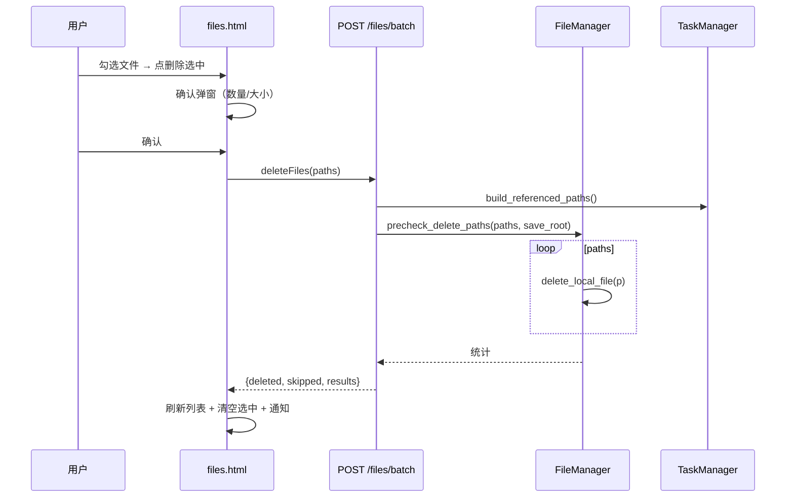
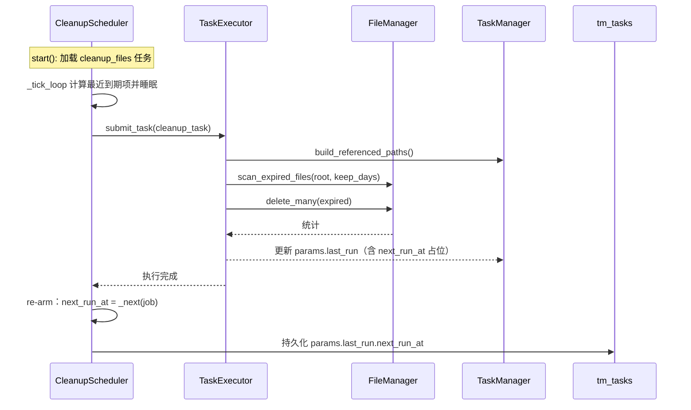

# 文件删除与定时清理 开发设计文档

> **项目名称**: Telegram_Restricted_Media_Downloader (TRMD)  
> **文档版本**: v1.0  
> **创建日期**: 2026-09-07  
> **状态**: 待评审  
> **关联文档**: 文件管理删除功能PRD.md、[模块设计-文件管理器.md](模块设计-文件管理器.md)、[模块设计-任务管理器.md](模块设计-任务管理器.md)、[模块设计-WebAPI.md](模块设计-WebAPI.md)、[模块设计-Web界面.md](模块设计-Web界面.md)

---

## 变更记录

| 版本 | 日期 | 变更内容 | 状态 |
|------|------|----------|------|
| v1.0 | 2026-09-07 | 初版：手动批量删除 + 定时清理任务（cleanup_files）设计 | 待评审 |

---

## 1. 设计目标与职责边界

### 1.1 设计目标

| 目标 | 说明 |
|------|------|
| **复用现有能力** | 删除复用 `FileManager.delete_local_file`/`safe_delete`；任务形态复用 TaskManager/TaskExecutor 管线 |
| **零 schema 迁移** | `tm_tasks`/`tm_task_items` 不新增列，调度参数与执行统计全部存放于既有 `params`/`extra` JSON |
| **最小化调度扩展** | 仅新增周期触发能力，不引入 cron 语法与外部依赖 |
| **安全第一** | 路径边界校验、系统目录黑名单、任务引用保护、二次确认四层防护 |
| **可观测** | 清理任务通过 `last_run` 统计 + 操作日志，删除可追溯 |

### 1.2 职责边界

```
┌─────────────────────────────────────────────────────────────────────────┐
│                                WebUI 层                                 │
│   files.html / files.js            tasks.html / tasks.js                │
│   └─ 勾选删除  ──┐                 └─ 创建/管理「定时清理」任务            │
└──────────────────┼──────────────────────────────────────────────────────┘
                   ▼
┌─────────────────────────────────────────────────────────────────────────┐
│                              API 层（FastAPI）                           │
│   DELETE /api/files/batch          POST /api/tasks（cleanup_files）      │
│                                    POST /api/tasks/{id}/run|pause|resume │
└───────────────┬──────────────────────────────────┬──────────────────────┘
                ▼                                  ▼
┌────────────────────────────┐      ┌───────────────────────────────────┐
│  FileManager（本模块扩展）   │      │  TaskManager / TaskExecutor       │
│  - delete_local_file(复用)  │      │  ├─ TaskType.CLEANUP_FILES        │
│  - scan_expired_files(新)   │      │  ├─ _execute_cleanup(新)          │
│  - precheck_delete_paths(新)│      │  └─ CleanupScheduler(新组件)       │
│  - referenced_paths 索引(新)│      │     ├─ 周期调度/re-arm             │
└────────────────────────────┘      │     ├─ 暂停/恢复/立即执行           │
                                    │     └─ next_run_at 持久化           │
                                    └───────────────────────────────────┘
```

**本模块不做的事**：不删除 Telegram 远端消息；不引入回收站/软删除；不改造 Bot 文件命令；不新增全局配置节（多策略由多任务承载）。

---

## 2. 后端设计

### 2.1 FileManager 扩展

在 `module/core/download/file_manager.py` 新增三个方法（不修改既有方法签名）：

#### 2.1.1 `scan_expired_files`

```python
async def scan_expired_files(
    self,
    root: str,
    keep_days: int,
    batch_size: int = 1000,
    referenced_paths: set[str] | None = None,
) -> list[FileInfo]:
    """递归扫描 root 下所有普通文件，返回满足过期条件的 FileInfo 列表。

    过期判定：file.mtime < now - keep_days 天（严格大于 keep_days 才删除）。
    过滤规则（与 list_files 一致）：跳过隐藏文件；跳过 .temp 后缀写入中文件；
    跳过 referenced_paths 中引用的路径（任务引用保护）。
    使用 os.scandir 递归（复用 _scan_directory 的路径安全与权限容错），
    以生成器/分页方式产出，单批 batch_size 条，避免大目录一次驻留内存。
    """
```

| 参数 | 类型 | 说明 |
|------|------|------|
| root | str | 扫描根目录，调用方保证等于 `config_manager.save_directory` 绝对路径 |
| keep_days | int | 保留天数（1~365） |
| batch_size | int | 单批上限，默认 1000 |
| referenced_paths | set[str] \| None | 任务引用保护索引（见 §2.4），传入绝对路径集合 |

#### 2.1.2 `precheck_delete_paths`

```python
async def precheck_delete_paths(
    self,
    paths: list[str],
    save_root: str,
) -> list[DeleteCheckResult]:
    """批量路径安全预检，返回逐条结果（不执行删除）。

    单条检查顺序：
      1. 绝对化 + normpath
      2. 必须在 save_root 之下（防越界）
      3. _check_system_path 黑名单
      4. 不存在 → 视为已删除（幂等，accept）
      5. 是目录 → 拒绝（手动删除仅支持文件）
    失败条目不阻断其余条目。
    """
```

新增 dataclass：

```python
@dataclass
class DeleteCheckResult:
    path: str                 # 规范化绝对路径
    ok: bool                  # 是否允许删除
    reason: str | None = None # 拒绝原因（OUT_OF_BOUNDS / SYSTEM_PATH / IS_DIRECTORY / TASK_REFERENCED / IN_PROGRESS）
```

#### 2.1.3 `delete_many`

```python
async def delete_many(self, paths: list[str]) -> dict:
    """批量删除（每条均过 precheck + 引用保护后调用 delete_local_file）。

    返回统计：{"total", "deleted", "failed", "skipped", "results": [...]}
    results[i] = {"file_path", "success", "deleted", "skipped", "reason"}
    幂等：目标不存在视为已删除（delete_local_file/safe_delete 对不存在路径返回 True）。
    """
```

> **设计说明**：`scan_expired_files`（定时清理用）与 `precheck_delete_paths`（手动删除用）共用同一套保护规则，但入口分离，避免两个场景相互耦合。

### 2.2 手动批量删除接口

文件：`module/api/routes/files.py`

```python
@router.delete("/batch")
async def delete_files_batch(
    request: Request,
    body: FileBatchDeleteRequest,
    token: str = Depends(require_token),
):
    """批量删除本地文件（仅支持文件，二次确认由前端完成）。"""
```

请求模型 `module/api/models/file.py`：

```python
class FileBatchDeleteRequest(BaseModel):
    file_paths: list[str] = Field(min_length=1, max_length=500)
```

响应统一使用现有 `json_response` 信封（`{code, data, message}`），data 结构：

```json
{
  "total": 2, "deleted": 1, "failed": 0, "skipped": 1,
  "results": [
    {"file_path": "...", "success": true, "deleted": true, "skipped": false, "reason": null},
    {"file_path": "...", "success": true, "deleted": false, "skipped": true, "reason": "task_referenced"}
  ]
}
```

校验流程（伪代码）：

```
1. len(file_paths) 1~500，超出 → 400
2. save_root = abspath(config_manager.save_directory)
3. 引用索引 = referenced_paths_index(task_manager)   # §2.4
4. for p in file_paths:
     a. 规范化 + save_root 越界检查
     b. 系统目录黑名单检查
     c. not 文件（目录/不存在）→ 按预检规则处理
     d. p 或 p+".temp" ∈ referenced_paths → skip("task_referenced"/"in_progress")
     e. delete_local_file(p) → deleted
5. 返回统计
```

### 2.3 定时清理任务（cleanup_files）

#### 2.3.1 任务类型注册

- `module/core/task/manager.py`：`TaskType` 枚举新增 `CLEANUP_FILES = "cleanup_files"`
- `module/api/models/task.py`：`TaskType = Literal[...]` 增加 `"cleanup_files"`
- `module/api/models/common.py`（若存在 task_type 校验）同步白名单
- `module/api/routes/tasks.py` `create_task` 的 `type_map` 增加：

```python
type_map = {
    ...
    "listen_forward": TaskType.LISTEN_FORWARD,
    "cleanup_files": TaskType.CLEANUP_FILES,
}
```

#### 2.3.2 创建参数处理

在 `create_task` 中对 `cleanup_files` 分支做参数校验与规整（与上传等类型平级）：

```python
if task_type == TaskType.CLEANUP_FILES:
    keep_days = params.get("keep_days")
    if not isinstance(keep_days, int) or not (1 <= keep_days <= 365):
        return error_json_response(code=400, message="keep_days 需为 1~365 的整数", status_code=400)
    schedule = _normalize_cleanup_schedule(params.get("schedule"))  # daily|interval 校验
    task_params.update({
        "keep_days": keep_days,
        "schedule": schedule,
        "scan_root": None,                  # 恒为整个下载目录
        "remove_empty_dirs": params.get("remove_empty_dirs", True),
        "last_run": {
            "scanned": 0, "deleted": 0, "freed_bytes": 0,
            "started_at": None, "finished_at": None, "next_run_at": None,
        },
    })
    # 以下对 cleanup_files 无意义，置空/忽略：chat_id、source_identifier、
    # message_range、file_paths、size 过滤、仓库备份等
```

`_normalize_cleanup_schedule` 规则：

| mode | 合法参数 | 非法处理 |
|------|----------|----------|
| daily | `time` 匹配 `^(0?[0-9]|1[0-9]|2[0-3]):[0-5][0-9]$` | 400 拒绝 |
| interval | `interval_hours` ∈ [1,72] 整数 | 400 拒绝 |
| 缺省 | — | 默认 `{"mode": "daily", "time": "03:00"}` |

#### 2.3.3 执行器：`_execute_cleanup`

文件：`module/core/task/executor.py`

```python
async def _execute_cleanup(self, task: Task) -> None:
    """执行一轮清理：扫描 → 判定 → 删除 → 写 last_run → 触发调度重注册。

    与监听任务一致：不调用 complete_task，任务保持 running（周期任务活性态）。
    执行细节：
      1. root = abspath(config_manager.save_directory)
      2. keep_days = task.params["keep_days"]
      3. referenced = referenced_paths_index(task_manager)（§2.4）
      4. expired = await file_manager.scan_expired_files(root, keep_days, referenced_paths=referenced)
      5. 分批 delete_many；累计 deleted / freed_bytes
      6. 更新 task.params["last_run"]，由 CleanupScheduler 持久化 next_run_at
      7. remove_empty_dirs=true → 自底向上移除空目录（仅 save_directory 内）
      8. 写统计日志：scanned / deleted / freed_bytes / 耗时
    """
```

**放弃状态流转的原因**：周期任务若每次执行后进 `completed`，需要每次"重新创建任务"，任务 ID 变化、暂停/恢复语义丢失。采用监听任务的 `running` 常驻模式，配合 `params.last_run.next_run_at` 表达下次执行时间，语义最清晰。

#### 2.3.4 新组件：CleanupScheduler

归属：`TaskExecutor` 内部组件（复用其绑定的 Telegram Client 事件循环，避免跨 loop），通过 `set_executor`/初始化阶段注入 `TaskManager` 与 `FileManager` 引用。

```python
class CleanupScheduler:
    """周期任务调度器：仅负责 cleanup_files 任务的时钟触发与生命周期管理。"""

    def __init__(self, task_manager: TaskManager, executor: TaskExecutor):
        self._tm = task_manager
        self._executor = executor
        self._loop_task: asyncio.Task | None = None
        self._jobs: dict[str, dict] = {}   # task_id -> {task, next_run_at, paused}
        self._lock = asyncio.Lock()

    # ---- 生命周期 ----
    async def start(self) -> None:          # 由 executor 在事件循环启动后调用
        await self._load_tasks()            # 从 DB 加载所有未删除的 cleanup_files 任务
        self._loop_task = asyncio.create_task(self._tick_loop())

    async def stop(self) -> None:           # 取消 _tick_loop
        ...

    # ---- 任务管理 ----
    def register(self, task: Task) -> None      # 创建任务后注册（API create 成功后回调）
    def unregister(self, task_id: str) -> None  # 任务删除/取消时注销
    def pause(self, task_id: str) -> None       # 暂停调度（保存 paused=true 于 params）
    def resume(self, task_id: str) -> None      # 恢复调度（重算 next_run_at）

    async def run_now(self, task_id: str) -> None
        # 「立即清理」：直接投递一次 _execute_cleanup，不重排时钟
        # self._executor.submit_task(task)

    # ---- 调度主循环 ----
    async def _tick_loop(self) -> None:
        while True:
            await self._sleep_until_nearest(next_run_at_set)   # 睡到最近到期项
            due = [job for job in self._jobs.values()
                   if not job.paused and job.next_run_at <= now]
            for job in due:
                await self._dispatch(job)                       # submit_task
                job.next_run_at = self._next(job)               # re-arm
                await self._persist_next_run(job)               # 写 params.last_run.next_run_at

    def _next(self, job) -> datetime:
        # mode=daily: 下一个 time 时刻；mode=interval: now + interval_hours
        # 基于配置时区（module/utils/timezone.py）计算，避免 UTC 偏移
```

**接口暴露**（供 API 层使用）：

| 方法 | 对应 API | 说明 |
|------|----------|------|
| `pause(task_id)` | POST /tasks/{id}/pause | 置 paused=true；`next_run_at` 清空 |
| `resume(task_id)` | POST /tasks/{id}/resume | 置 paused=false；按周期重算 next_run_at |
| `run_now(task_id)` | POST /tasks/{id}/run | 立即执行一轮，不改周期 |
| `register/unregister` | create/delete 回调 | 保持调度器与任务列表一致 |

**与现有执行模型的关系**：
- 复用 `executor.submit_task`（`run_coroutine_threadsafe`），保证 Web API 线程与 Client 循环之间的投递正确性
- 受 `TaskManager.start_task` 的并发闸门约束吗？——**不受**。`cleanup_files` 不走 `_task_queue`（队列是消息型任务专用），而是由调度器直接投递；`_execute_cleanup` 内部按 `batch_size` 分页且可被取消，保证不会长期占满执行器
- 取消/删除 `cleanup_files` 任务时：`cancel_task` 取消调度器对应 job（`unregister`），并将任务置 `cancelled`；`delete_task` 删除记录并注销

### 2.4 任务引用保护索引

统一供「手动批量删除」与「定时清理」复用，实现于 TaskManager 扩展方法：

```python
async def build_referenced_paths(self) -> set[str]:
    """收集当前被 active 任务引用的本地文件路径集合。

    来源（状态为 pending/queued/running 且未完成的非 cleanup 任务）：
      1. TaskRecord.params.file_paths        # 排队中的 upload 任务目标文件
      2. TaskItemRecord.file_path           # download 子项的保存路径/上传子项目标
      3. 下载中的中间文件：file_path + ".temp" 一并纳入
    """
```

> **复杂度说明**：download 任务的保存路径由 downloader 按频道/时间规则动态生成，落地前无法从 params 精确推断。因此引用保护以**已落地的 TaskItemRecord.file_path** 为准（item 在开始下载时创建），再加 `.temp` 后缀兜底覆盖"正在写入但尚未建 item"的间隙。扫描频率低（删除时构建一次），对性能无影响。

### 2.5 任务操作接口（新增）

文件：`module/api/routes/tasks.py`

| 方法 | 路径 | 逻辑 |
|------|------|------|
| POST | /api/tasks/{id}/run | 仅 `cleanup_files` 允许；调用 `CleanupScheduler.run_now` |
| POST | /api/tasks/{id}/pause | 仅 `cleanup_files` 允许；调用 `CleanupScheduler.pause` |
| POST | /api/tasks/{id}/resume | 仅 `cleanup_files` 允许；调用 `CleanupScheduler.resume` |

非 `cleanup_files` 任务调用上述接口 → 400（附原因）。

**调度器实例获取**：`TaskExecutor` 暴露 `self.cleanup_scheduler`，API 层通过 `request.app.state.task_executor` 获取；executor 未初始化时返回 503「任务执行器未就绪」。

### 2.6 依赖注入与启动顺序

- `module/core/task/executor.py` 初始化（由 downloader 在 client 启动后延迟初始化，见 `app.py` L91 注释）：初始化完成后调用 `await self.cleanup_scheduler.start()`
- 服务关闭：`async_cleanup` 过程中调用 `await self.cleanup_scheduler.stop()`
- 测试注入：`create_app` 已支持注入 Mock `task_manager`/`file_manager`；调度器依赖同一套实例

---

## 3. 数据模型与存储

`tm_tasks` / `tm_task_items` 表结构不变（零迁移）。`cleanup_files` 任务的全部状态存放于 `TaskRecord.params`：

```json
{
  "keep_days": 7,
  "schedule": { "mode": "daily", "time": "03:00" },
  "scan_root": null,
  "remove_empty_dirs": true,
  "paused": false,
  "last_run": {
    "scanned": 1250,
    "deleted": 320,
    "freed_bytes": 2147483648,
    "started_at": "2026-09-07T03:00:01+08:00",
    "finished_at": "2026-09-07T03:00:12+08:00",
    "next_run_at": "2026-09-08T03:00:00+08:00"
  }
}
```

| 字段 | 类型 | 说明 |
|------|------|------|
| paused | Boolean | 暂停标志，重启后保持（§2.3.4 pause/resume） |
| last_run.next_run_at | ISO8601 | 下一次计划执行时间（带时区）；暂停/创建时为 null |

---

## 4. 前端设计

### 4.1 api.js 新增方法

```javascript
// 文件
async deleteFiles(filePaths)        // DELETE /api/files/batch
// 任务
async runTask(taskId)               // POST /api/tasks/{taskId}/run
async pauseTask(taskId)             // POST /api/tasks/{taskId}/pause
async resumeTask(taskId)            // POST /api/tasks/{taskId}/resume
```

### 4.2 文件管理页（files.html / files.js）

顶部操作栏在「上传选中文件」旁新增：

```html
<button data-testid="delete-selected-btn"
        @click="openDeleteModal()"
        :disabled="selectedFiles.length === 0">
  🗑️ 删除选中
</button>
```

确认弹窗（`delete-modal`）：

- 展示：选中文件数、总大小、警示文案（物理删除不可恢复；运行中任务引用文件将被跳过）
- 按钮：取消 / 确认删除
- 确认后调用 `api.deleteFiles(selectedFiles.map(f => f.path))`；执行中禁用按钮
- 完成后：`await this.loadFiles(currentPath)` 刷新 + `this.selectedFiles = []` + 通知统计（成功/失败/跳过）

files.js 新增方法：`openDeleteModal()`、`confirmDelete()`、`_applyDeleteResult(result)`。
复用 `fileManager.formatFileSize` 展示总大小。

### 4.3 任务管理页（tasks.html / tasks.js）

**类型选项**：新建任务弹窗类型 radio 增加「🧹 定时清理」(`value="cleanup_files"`)。

**参数表单**（`x-show="createForm.taskType === 'cleanup_files'"`）：

| 控件 | 绑定字段 | 说明 |
|------|----------|------|
| 保留天数预设下拉 | `createForm.keepDaysPreset` | 1日/3日/7日/30日/自定义 |
| 自定义天数输入 | `createForm.keepDays` | 1~365，preset=自定义时显示 |
| 调度模式 radio | `createForm.scheduleMode` | 每天固定时刻 / 每隔 N 小时 |
| 时刻输入 | `createForm.scheduleTime` | type="time"，mode=daily 时显示 |
| 间隔输入 | `createForm.scheduleIntervalHours` | 1~72，mode=interval 时显示 |
| 空目录清理开关 | `createForm.removeEmptyDirs` | 默认开 |

**校验**（tasks.js `validateCreateForm` 新增分支）：keepDays 1~365、time 格式、interval 1~72。

**payload 构建**（`_buildCreatePayload` 新增分支）：

```javascript
} else if (this.createForm.taskType === "cleanup_files") {
  params.keep_days = this.createForm.keepDays;
  params.schedule = this.createForm.scheduleMode === "daily"
    ? { mode: "daily", time: this.createForm.scheduleTime }
    : { mode: "interval", interval_hours: this.createForm.scheduleIntervalHours };
  params.remove_empty_dirs = this.createForm.removeEmptyDirs;
}
```

**详情抽屉**（`tasks.html` 增加 `cleanup_files` 分支）：

- 保留天数
- 调度模式与下次执行时间（`params.last_run.next_run_at`）
- 最近一次统计：扫描文件数 / 删除数 / 释放空间 / 耗时
- 操作按钮：立即清理（`runTask`）、暂停/恢复（`pauseTask`/`resumeTask`），按 `params.paused` 切换文案

**列表能力**：类型筛选新增「定时清理」（`setTypeFilter('cleanup_files')`）；`getTypeText` 映射新增 `cleanup_files: "🧹 定时清理"`；`_handleUrlParams` 白名单增加 `cleanup_files`。

---

## 5. 关键流程时序

### 5.1 手动批量删除



### 5.2 定时清理触发（周期）



---

## 6. 异常处理与安全

| 场景 | 处理 |
|------|------|
| 路径越界 / 系统目录 | `precheck` 拒绝，单条失败不阻断 |
| 被引用文件（上传/下载中） | `referenced_paths` 命中 → skipped；`.temp` 命中 → in_progress |
| 删除失败（权限/IO） | 单条 failed + 原因；任务级 `last_run` 记录失败明细 |
| 大目录扫描 | `scan_expired_files` 分页（batch_size=1000），scheduler 取消信号中断当前批 |
| 重复触发（多个周期重叠） | 调度器串行投递（`_lock`），同一任务不并发两轮 |
| 时区 | 调度与过期判定统一走 `module/utils/timezone.py` 配置时区 |
| executor 未就绪 | run/pause/resume 返回 503 |
| 服务重启 | `start()` 重新加载任务；错过窗口（<1 周期）启动后立即补一轮；paused 状态保持 |
| 幂等 | `safe_delete` 对不存在路径返回 True；重复清理无副作用 |

---

## 7. 测试计划

### 7.1 单元测试

| 文件 | 用例 |
|------|------|
| tests/unit/core/download/test_file_manager.py | `scan_expired_files`：过期边界（恰等于 keep_days 保留）、隐藏文件跳过、`.temp` 跳过、referenced_paths 过滤、分页 |
| 同上 | `precheck_delete_paths`：越界/黑名单/目录/不存在各分支 |
| 同上 | `delete_many`：部分失败/skipped 统计、幂等 |
| tests/unit/core/task/test_executor.py | `_execute_cleanup`：正常一轮、无过期文件、取消中断 |
| tests/unit/core/task/test_manager.py | `build_referenced_paths`：从 params.file_paths 与 task items 收集、排除已完成任务 |
| tests/unit (新增) test_cleanup_scheduler.py | `_next`（daily/interval 与时区）、re-arm 持久化、pause/resume/run_now 语义、重复投递防抖 |
| tests/unit/api/test_web_api.py | `DELETE /files/batch` 契约（成功/混合/越界/超限 500 条）、`POST /tasks` cleanup 参数校验、run/pause/resume 的 400/404/503 |
| tests/unit/api/test_web_ui_templates.py | tasks.html 存在 cleanup_files 表单与详情抽屉标记；files.html 存在 delete-selected-btn |

### 7.2 E2E 测试（tests/e2e/web/）

- `test_files.py`：删除选中流程（勾选 → 弹窗 → 确认 → 列表刷新）、无选中禁用、取消不删
- `test_tasks.py`：创建 cleanup_files 任务表单显隐校验、立即清理按钮、详情 last_run 展示、类型筛选、getTypeText

### 7.3 验收对照

| PRD 用例 | 对应测试 |
|----------|----------|
| D1~D6 | test_files.py 删除用例 + test_web_api.py batch 契约 |
| T1~T9 | test_tasks.py + test_cleanup_scheduler.py（T2/T9 过期判定在单测覆盖） |

---

## 8. 兼容性与迁移

| 项 | 影响 |
|----|------|
| 既有任务 | `TaskType` 枚举与 Literal 追加不影响既有任务反序列化（字符串匹配） |
| 既有接口 | `POST /tasks` 增加类型不影响既有类型校验；新增端点无破坏 |
| WebUI | 新增元素/方法为增量；tasks.js `typeFilter` 注释与 `getTypeText` 映射扩展 |
| 数据库 | 零 schema 变更；历史任务 params 无 `last_run` 时前端 `?.` 安全取值 |
| Bot | 不受影响（不新增/改动命令） |
| 打包 | `.trae-html-share-packages` 前端 zip 随 files.html/tasks.html 变更自动同步 |

---

## 9. 实施拆解（按依赖顺序）

| # | 任务 | 涉及文件 |
|---|------|----------|
| 1 | FileManager 扩展（scan/precheck/delete_many + DeleteCheckResult） | download/file_manager.py |
| 2 | 手动删除 API + 模型 | routes/files.py、models/file.py |
| 3 | 手动删除前端 | files.html、files.js、api.js |
| 4 | TaskType + 创建参数处理 + 校验 | task/manager.py、api/models/task.py、routes/tasks.py |
| 5 | `_execute_cleanup` + 引用索引 `build_referenced_paths` | task/executor.py、task/manager.py |
| 6 | CleanupScheduler + 启动/关闭钩子 + run/pause/resume 接口 | task/executor.py、task/scheduler.py(新)、routes/tasks.py、api/app.py |
| 7 | 定时清理前端 | tasks.html、tasks.js、api.js |
| 8 | 测试补充与回归 | 见 §7 |
| 9 | 文档同步（PRD 验收核对、openapi 导出） | docs/ |